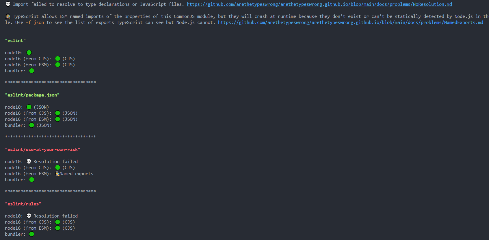

# Issue with ESLint's Type Definitions

## Overview

This repository addresses issues with the current type definitions for ESLint. Below are the identified problems and their respective solutions.

## Issues and Solutions

### 1. Subpath Exports with TypeScript's [**`Node10`**](https://www.typescriptlang.org/docs/handbook/modules/reference.html#node10-formerly-known-as-node) Module Resolution

**Problem**: The subpath exports `eslint/use-at-your-own-risk` and `eslint/rules` do not work under TypeScript's [**`Node10`**](https://www.typescriptlang.org/docs/handbook/modules/reference.html#node10-formerly-known-as-node) module resolution strategy.

<details>

  <summary>Note</summary>
  You can test for this by running `yarn test`. This also becomes apparent if you run:

```bash
npx @arethetypeswrong/cli@latest --from-npm eslint
```

Here is a before and after:

#### **Before:**



#### **After:**


</details>

**Solution**: Use [**`typesVersions`**](https://github.com/andrewbranch/example-subpath-exports-ts-compat/tree/main/examples/node_modules/types-versions-wildcards) to satisfy TypeScript's [**`Node10`**](https://www.typescriptlang.org/docs/handbook/modules/reference.html#node10-formerly-known-as-node) module resolution:

```json
  "typesVersions": {
    "*": {
      "use-at-your-own-risk": [
        "./lib/types/use-at-your-own-risk.d.ts"
      ],
      "rules": [
        "./lib/types/rules/index.d.ts"
      ]
    }
  },
```

### 2. Mismatch in Named Exports with TypeScript's [**`Node16`**](https://www.typescriptlang.org/docs/handbook/modules/reference.html#node16-nodenext-1) ESM Module Resolution

**Problem**: There is a mismatch between the named exports in `eslint/use-at-your-own-risk` during runtime and the type definitions under TypeScript's [**`Node16`**](https://www.typescriptlang.org/docs/handbook/modules/reference.html#node16-nodenext-1) ESM module resolution strategy. The type definitions indicate the following named exports:

```ts
{
  FileEnumerator, FlatESLint, LegacyESLint, builtinRules, shouldUseFlatConfig
}
```

But if we try to import these named exports in an ESM file, we learn that only `builtinRules` is available.

**Solution**: We can do change the exports in `lib/unsupported-api.js` from:

```js
module.exports = {
  builtinRules: require('./rules'),
  FlatESLint,
  shouldUseFlatConfig,
  FileEnumerator,
  LegacyESLint,
}
```

to:

```js
const builtinRules = require('./rules')

module.exports = {
  builtinRules,
  FlatESLint,
  shouldUseFlatConfig,
  FileEnumerator,
  LegacyESLint,
}
```

<details>

  <summary>
  View Diff
  </summary>

```diff
+const builtinRules = require('./rules')
+
 module.exports = {
-  builtinRules: require('./rules'),
+  builtinRules,
   FlatESLint,
   shouldUseFlatConfig,
   FileEnumerator,
 }
```

</details>

## Reproduction Steps

1. Clone this repository.
2. Run `yarn install`.
3. Run `yarn test`.
